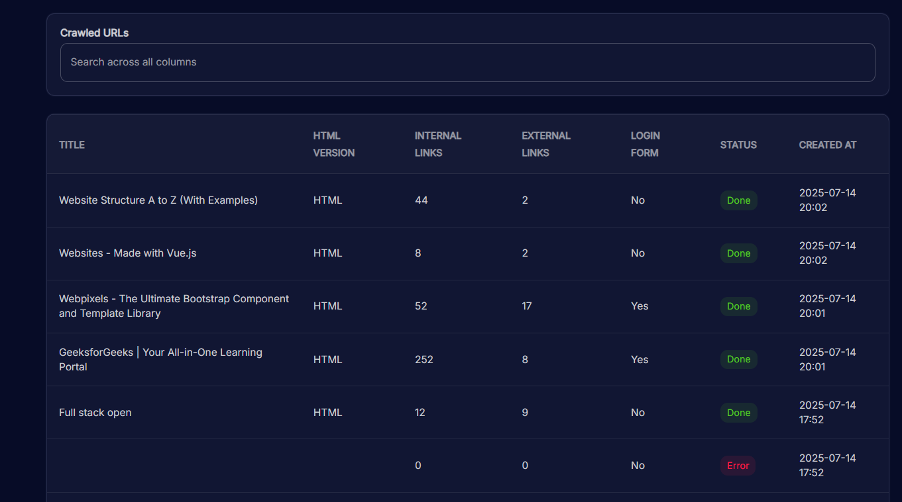

## Scrawling Dashboard

A crawling dashboard extracts information from a given URL, including:
- HTML version
- Page title
- Headings count (H1–H6)
- Internal and external links
- Broken links (4xx/5xx)
- Presence of a login form

## Requirements

- Frontend: React18 + Typescript + Material-UI
- Backend: Go 1.20+, chrome/chromium installed (for `chromedp`)
- (Optional) Postman or curl to test the API

## Run application

Clone the repo and create `.env` file at `/backend`:
```bash
MYSQL_DSN=avnadmin:<your-password>@tcp(<your-host>:<your-port>)/?tls=custom
APP_USERNAME=admin
APP_PASSWORD=password
SESSION_SECRET=your_session_secret
```

* Run backend, at the project root:
```bash
cd backend
go mod tidy
go run main.go
```

Connected to MySQL successfully  
2025/07/14 20:12:27 Server running at http://localhost:8080

* Run frontend, at the project root
```bash
cd frontend
npm install
npm start
```

Starting the development server...  
Compiled successfully!  

You can now view tokyo-free-black-react-admin-dashboard in the browser.  

  Local:            http://localhost:3000  
  On Your Network:  http://192.168.100.12:3000  

Note that the development build is not optimized.  
To create a production build, use npm run build.  

webpack compiled successfully
No issues found.

## Test mysql data from backend side

Test a post request


Check mysql data
```bash
\connect <username>@<host>:<port>
enter password
\sql
USE scrawling_db;
SHOW TABLES;
SELECT * FROM urls;
```

## Demo




