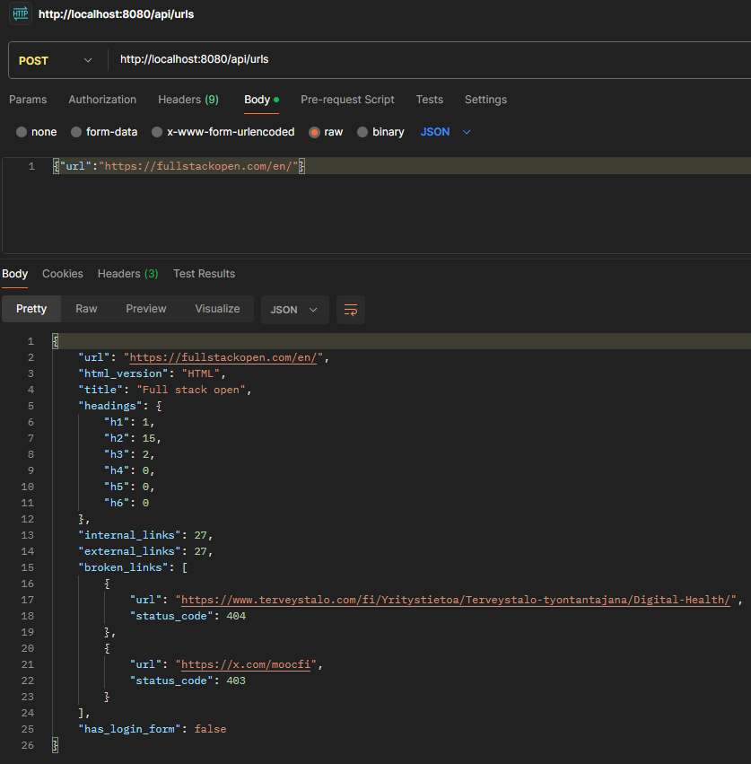

## Scrawling Dashboard - Backend

A web crawler that extracts information from a given URL, including:
- HTML version
- Page title
- Headings count (H1–H6)
- Internal and external links
- Broken links (4xx/5xx)
- Presence of a login form

## Requirements

- Go 1.20+
- Chrome/Chromium installed (for `chromedp`)
- (Optional) Postman or curl to test the API

## Run Backend

Prepare .env file:
```bash
MYSQL_DSN=avnadmin:<your-password>@tcp(<your-host>:<your-port>)/?tls=custom
APP_USERNAME=admin
APP_PASSWORD=password
SESSION_SECRET=your_session_secret
```

From the project root, enter following cmds:
```bash
cd backend
go run main.go
```

## Check mysql table

Use bash, enter following cmds
```bash
\connect <username>@<host>:<port>
enter password
\sql
USE scrawling_db;
SHOW TABLES;
SELECT * FROM urls;
```

## Results

